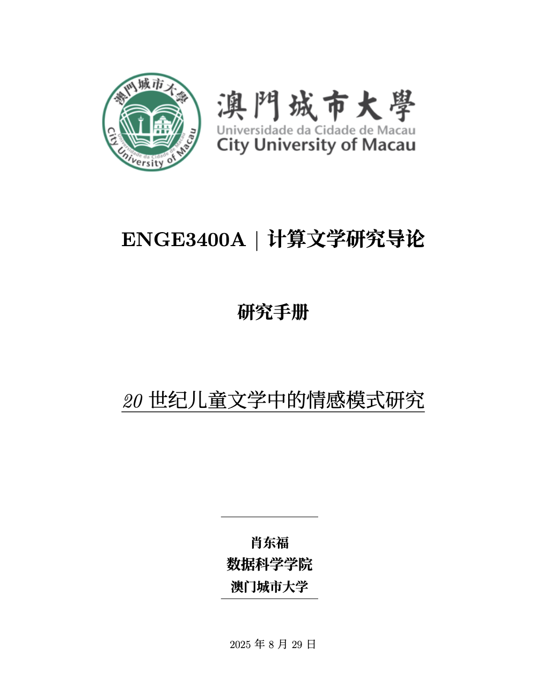
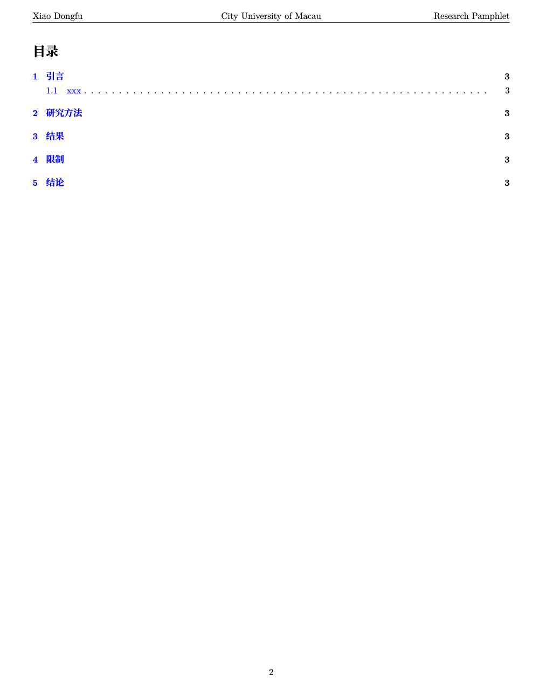

# Introduction
This is a **latex template** which you can finish your homework or finial paper in here for students in City University of Macau (the other school are also suitable, you just need to change the image file with your school badge). **This template covers the cover page, table of contents, main text and citations, meeting all the requirements for school assignments.** I have provided detailed annotations in the template. Even if you are a beginner, you can quickly get started. It is important to note that the **template style was designed by me** to assist in the completion of the project and is not official. **It can be modified according to actual needs！！！**

# Effect Performance
* *Cover*

* *Contents*

* *Main Text*

# How to Use
Open Overleaf (if you don't have an account, please register), click on "Create New Project" and select the blank project. Then download the main.tex and cityu.png files from my project and upload them to the newly created project. Finally, in the menu, select the XeLatex editing mode.

